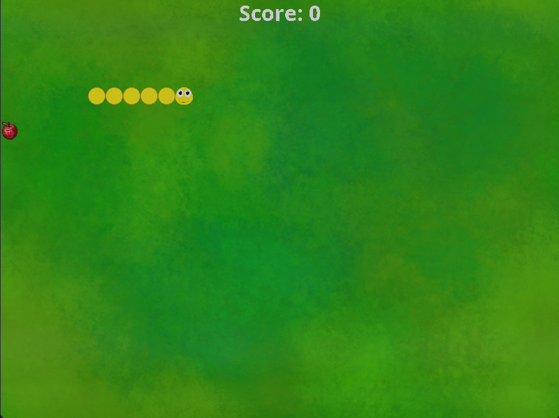

# 🐍 Snake Game

An implementation of the classic Snake arcade game, built entirely in **Java Swing**.



## ✨ Features

- **Complete game states**: Main Menu, Gameplay, Game Over
- **Visual polish**: Sprites, themed backgrounds, and smooth animations
- **Audio**: Background music + sound effects (hiss, apple crunch, game over)
- **Persistence**: High score saved between sessions
- **Responsive controls**: Arrow keys

## 🛠️ Technical Highlights

- **State Management**: Clean separation of UI screens using `JPanel` states
- **Threading**: Safe game loop with proper shutdown (`interrupt()`, `join()`)
- **Asset Management**: Centralized `SpriteManager` and `SoundManager`
- **File I/O**: High score persistence with error-safe loading/saving
- **Swing Best Practices**: Proper EDT usage, layout management, and rendering
- **Modular Design**: Entities, panels, and utilities cleanly separated

## 🎮 How to Play

1. Use **arrow keys** to control the snake
2. Eat apples to grow and increase your score
3. Avoid walls and colliding with yourself!
4. Beat your high score and hear satisfying audio feedback

## ▶️ Running the Game

### Prerequisites
- Java 11 or higher

### From Source
```bash
git clone https://github.com/rowanvictor01/snake-game.git
cd snake-game

# Linux/macOS
javac -d out $(find src -name "*.java")

# Windows Powershell
javac -d out (Get-ChildItem src -Recurse -Include *.java).FullName # Windows Powershell

# Windows CMD
javac -d out src\main\*.java src\panels\*.java src\utils\*.java src\entities\*.java

java -cp out main.Main

# OR
# Import into IntelliJ/Eclipse and run `Main.java`
```

## 🎨 Assets

All visual and audio assets are credited [here](CREDITS.md). Special thanks to the creators on [OpenGameArt.org](OpenGameArt.org)
and [Freesound.org](Freesound.org) for their generous contributions under CC BY and CC0 licenses.

## 💻 Project Structure

```
src/
├── entities/    # Game objects (Snake, Apple)
├── main/        # Core game logic (GameController, Window)
├── panels/      # UI screens (MainMenuPanel, GamePanel, etc.)
└── utils/       # Utility classes (SpriteManager, SoundManager, HighScoreManager)
```

## 📜 License

This project is licensed under the MIT License. 
Note: Game assets have separate license (see [CREDITS.md](CREDITS.md))